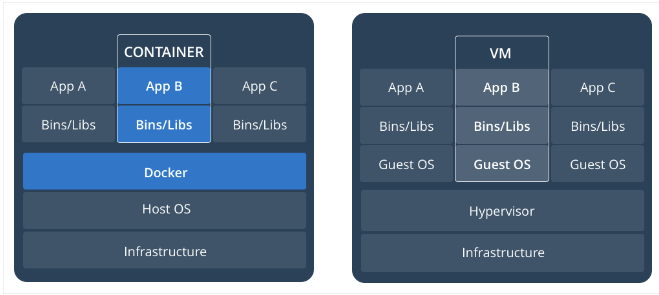

Images

Virtualization

Is the process of using special software (called hypervisor) on a physical machine (host) to create virtual machines (guest).
We can create as many as VMs as long as RAM, CPU allows
All VMs share same resources 

Hypervisor

A hypervisor is a computer software, firmware or hardware that creates and runs virtual machines. A computer on which a hypervisor runs one or more virtual machines is called a host machine, and each virtual machine is called a guest machine.

The hypervisor presents the guest operating systems with a virtual operating platform and manages the execution of the guest operating systems.

Types:
Type1 : Runs directly on top of host hardware ex. HyperKit / Hyper-V
Type2 : Runs as an app on the host OS. Ex. Virtual Box / VMWare


## Docker container are not VM

- A container runs natively on Linux and shares the kernel of the host machine with other containers.
- By contrast, a virtual machine (VM) runs a full-blown “guest” operating system with virtual access to host resources through a hypervisor.



```

	Container	          |		VMs
----------------------|--------------------------------
Starts in seconds	    | 	Starts in minutes
Saves resource	      |	Waste resource
Isolates applications	|	Isolates systems
Analogy: Apartments	  |	Analogy: Houses

```

## Orchestration

Now that you have containers, you might want to scale it. As we scale our applications up, we’ll want some tooling to help automate the maintenance of those applications, able to replace failed containers automatically and manage the rollout of updates and reconfigurations of those containers during their lifecycle.

Tools to manage, scale, and maintain containerized applications are called orchestrators, and the most common examples of these are [Kubernetes](https://kubernetes.io/) and [Docker Swarm](https://docs.docker.com/engine/swarm/). 

## Docker file

A Dockerfile is a text file that Docker reads in from top to bottom. It contains a bunch of instructions which informs Docker HOW the Docker image should get built.

You can relate it to cooking. In cooking you have recipes. A recipe lets you know all of the steps you must take in order to produce whatever you’re trying to cook.


## Docker Image

- An image includes everything needed to run an application -- the code or binary, runtimes, dependencies, and any other filesystem objects required.
- Essentially, images are templates used to create containers.

## Docker Conatiner

- Its running instance of image. 
- Fundamentally, a container is nothing but a **running process**, with some added encapsulation features applied to it in order to keep it isolated from the host and from other containers.
- One of the most important aspects of container isolation is that each container interacts with its own, private filesystem; 
- A container runs natively on Linux and shares the kernel of the host machine with other containers.
- containers effectively guarantee that those applications will run the same way anywhere,

